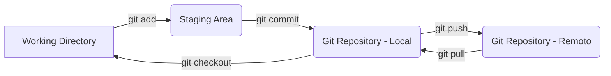

# 📘 Curso Simples e Rápido de Git e GitHub

## 👋 Contexto

Este é um tutorial introdutório ao **Git** e **GitHub**, ideal para iniciantes que desejam entender o funcionamento básico do versionamento de código com Git.

**Ministrado por:** *Linus Torvalds* (brincadeira... mas bem que poderia ser! 😉)

---

## 🔄 Etapas do Git (Fluxo de Trabalho)

---

## 🧰 Comandos Básicos do Git

* `git status`
  Exibe o status das modificações no seu diretório de trabalho e na área de staging.

* `git init`
  Inicializa um novo repositório Git local.

* `git add .`
  Adiciona todos os arquivos modificados e não rastreados para a área de staging.

* `git commit -m "First commit"`
  Cria um novo commit com a mensagem informada.

* `git remote add origin <repositório remoto>`
  Adiciona um repositório remoto com o nome `origin`.

* `git branch -M main`
  Renomeia a branch atual para `main`.

* `git push origin main`
  Envia os commits da branch `main` local para o repositório remoto `origin`.

---

## ⚙️ Configurações Globais do Git

* `git config --global --list`
  Lista todas as configurações globais do Git.

* `git config --global user.name "Seu nome"`
  Define o nome de usuário global para seus commits.

* `git config --global user.email "Seu email"`
  Define o e-mail global para seus commits.

> 💡 As configurações podem ser definidas **globalmente** (para todos os projetos) ou **localmente** (para um projeto específico, removendo a flag `--global`).

---

## 🧭 Legenda

| Termo                       | Descrição                                                                |
| --------------------------- | ------------------------------------------------------------------------ |
| **Working Directory**       | Sua pasta de trabalho local com os arquivos do projeto.                  |
| **Staging Area**            | Área temporária onde você prepara as mudanças para o commit.             |
| **Git Repository - Local**  | Banco de dados local onde o Git armazena o histórico do seu projeto.     |
| **Git Repository - Remoto** | Versão do seu repositório hospedada em um servidor (ex: GitHub, GitLab). |
| `git add`                   | Adiciona arquivos do *Working Directory* para o *Staging Area*.          |
| `git commit`                | Grava as mudanças do *Staging Area* no repositório local.                |
| `git push`                  | Envia commits do repositório local para o remoto.                        |
| `git pull`                  | Baixa commits do repositório remoto para o local.                        |
| `git checkout`              | Alterna entre branches ou restaura arquivos do repositório.              |

---

## ✅ Pronto para começar!

Agora você já conhece o básico do Git. Pratique, crie repositórios, experimente os comandos e use o GitHub para colaborar com outras pessoas!
